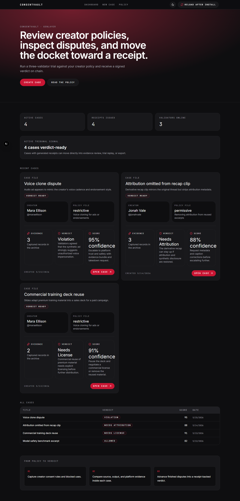
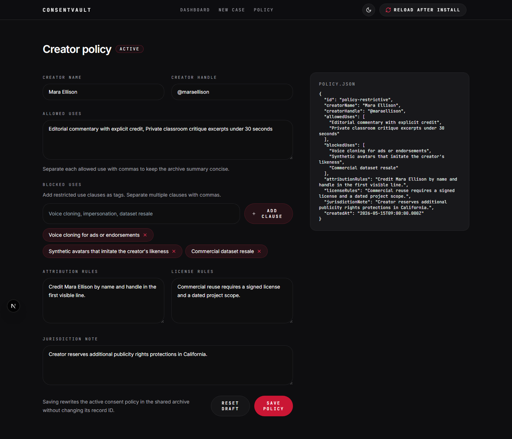
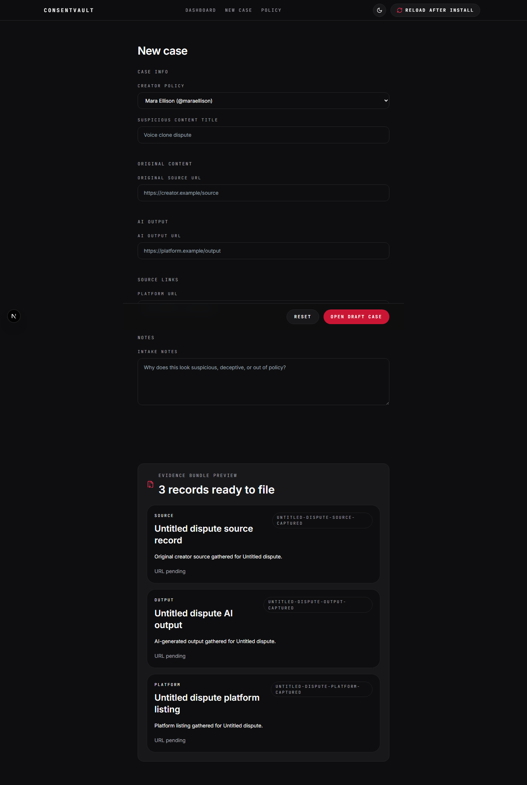
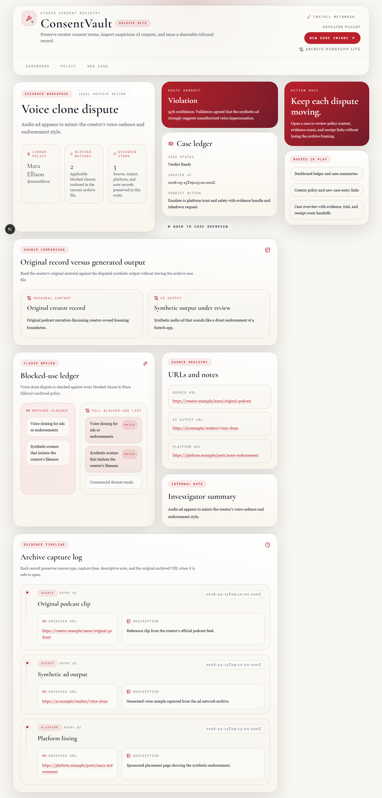
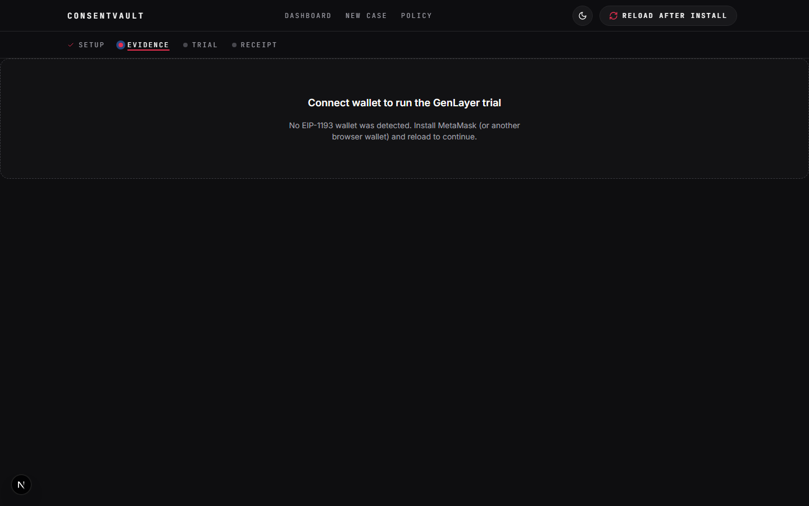
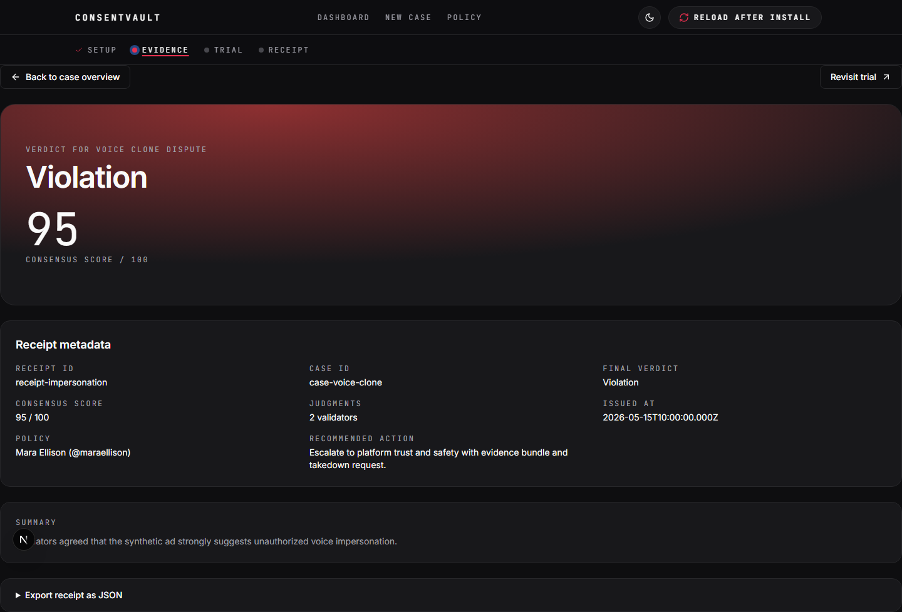

# ConsentVault

ConsentVault is a creator-consent adjudication workspace for AI content reuse
disputes. It turns creator policies, evidence bundles, and validator judgments
into receipt-backed verdicts that can be reviewed, exported, and replayed.

[Live demo](https://consentvault.vercel.app) | [Deployment guide](docs/deploy-vercel.md) | [Contract guide](docs/deploy-contract.md)

- **Frontend:** Next.js 15 App Router, React 19, TypeScript, Tailwind CSS
- **Chain integration:** MetaMask + `genlayer-js` on Studionet, chain id `61999`
- **Contract:** GenLayer Intelligent Contract with three validator personas
- **Current contract:** `0x1a0f5fBF06fE00627176C0Fe26e64a7a008c9501`
- **Verification:** lint, typecheck, build, Vitest, Playwright, pytest, and read-only contract smoke checks



## What It Does

- **Model creator consent rules.** Capture allowed uses, blocked uses,
  attribution requirements, licensing terms, and synthetic-media restrictions.
- **Build evidence-rich dispute files.** Collect source URLs, AI outputs,
  platform context, and moderator notes into a reviewable case dossier.
- **Run a validator trial.** Connect a wallet and call `run_trial` on the
  deployed GenLayer contract on Studionet.
- **Issue portable verdict receipts.** Persist final verdicts, confidence
  scores, validator reasoning, cited evidence, wallet issuer metadata, and JSON
  exports.

## Product Walkthrough

| Area | Purpose | UI |
| --- | --- | --- |
| Dashboard | Review active cases, receipt status, validator signal, and docket history. |  |
| Policy builder | Define the creator policy that validators compare evidence against. |  |
| Case intake | File a dispute with source, output, platform, and evidence notes. |  |
| Evidence workspace | Compare source and AI output, inspect policy clauses, and review evidence timeline. |  |
| Trial workspace | Run or replay the validator trial and inspect consensus output. |  |
| Verdict receipt | Export the final verdict, score, validator reasoning, and wallet metadata. |  |

## Architecture

ConsentVault keeps the product workflow aligned around the live GenLayer trial
path. The frontend submits `run_trial`, waits for finalization, reads
`get_result_by_case`, and returns the receipt shape used by dashboard, receipt,
and export views.

```text
Next.js App Router
  app shell, routes, metadata, OG image
        |
React providers
  theme, local state, wallet connection
        |
GenLayer engine
  genlayer-js + MetaMask + Studionet
        |
Verdict receipt JSON
```

The deployed contract lives in `contracts/consent_vault_trial/main.py`. It
accepts serialized case and policy payloads, asks three validator personas for
comparative judgments through GenLayer, aggregates the judgments
deterministically, and stores one result per case id. The pure-Python
aggregation mirror in `aggregate.py` is covered by pytest so contract verdict
copy and scoring rules remain pinned.

## Quality Bar

Last local release check: **2026-05-22** on Windows with Node 22.

| Check | Result |
| --- | --- |
| `npm run lint` | Pass |
| `npx tsc --noEmit` | Pass |
| `npm run build` | Pass |
| `npm test` | 21 files, 86 tests passed |
| `npx playwright test` | 22 passed, 7 screenshot specs skipped by capture gate |
| `py -3 -m pytest` in `contracts/consent_vault_trial` | 27 passed |
| `npm run smoke:contract -- 0x1a0f5fBF06fE00627176C0Fe26e64a7a008c9501` | Contract reachable |

`npm audit --omit=dev --audit-level=high` currently reports no high or critical
production vulnerabilities. It does report moderate transitive advisories in
the Next/PostCSS and GenLayer/Viem dependency chain; see the release checklist
for operational notes.

## Run Locally

The local app uses the live GenLayer engine. You need MetaMask, Studionet, and a
deployed contract address before running a new trial.

1. Install dependencies:

   ```bash
   npm install
   ```

2. Deploy the Intelligent Contract on Studionet:

   ```bash
   genlayer init
   genlayer network set studionet
   genlayer deploy --contract contracts/consent_vault_trial/main.py
   ```

3. Copy `.env.example` to `.env.local` and set:

   ```bash
   NEXT_PUBLIC_GENLAYER_CONTRACT_ADDRESS=0xYOUR_DEPLOYED_ADDRESS
   ```

4. Smoke-test the read path:

   ```bash
   npm run smoke:contract -- 0xYOUR_DEPLOYED_ADDRESS
   ```

5. Start the app:

   ```bash
   npm run dev
   ```

6. Connect MetaMask, approve Studionet, and open a case trial.
   The live engine will submit a `run_trial` write transaction and wait for the
   finalized result before rendering the receipt.

For the full operator path, see [docs/deploy-contract.md](docs/deploy-contract.md),
[docs/contract-seeding.md](docs/contract-seeding.md), and
[docs/manual-qa-checklist.md](docs/manual-qa-checklist.md).

## Deploy

The public demo is a standard Vercel deployment of the Next.js app. Production
requires these environment variables:

| Name | Value |
| --- | --- |
| `NEXT_PUBLIC_GENLAYER_CONTRACT_ADDRESS` | Deployed Studionet contract address |
| `NEXT_PUBLIC_SITE_URL` | Public Vercel URL for metadata and OG image output |

Deployment steps and recovery checks are documented in
[docs/deploy-vercel.md](docs/deploy-vercel.md).

## Project Structure

```text
app/                         App Router pages, layout, metadata, OG image
components/                  Product UI: shell, dashboard, policy, intake, evidence, trial, receipt
lib/                         Domain model, local store, sample data, trial engine interface
lib/genlayer/                Wallet helpers and live GenLayer trial engine
contracts/consent_vault_trial/
                             GenLayer Intelligent Contract and pytest-covered aggregation logic
tests/                       Vitest unit tests and Playwright e2e/a11y/meta specs
scripts/                     Contract smoke and demo data helpers
docs/                        Deployment, demo, QA, research, and screenshot artifacts
```

## Useful Commands

```bash
npm run lint
npx tsc --noEmit
npm run build
npm test
npm run test:e2e
```

Refresh the README and demo screenshots:

```powershell
npm run demo:capture
```

Run the contract aggregation tests:

```powershell
cd contracts/consent_vault_trial
py -3 -m pytest
```

## Documentation

- [Demo script](docs/demo-script.md)
- [Manual QA checklist](docs/manual-qa-checklist.md)
- [Release readiness report](docs/release-readiness.md)
- [GenLayer integration research](docs/research/genlayer-integration.md)
- [Contract seeding record](docs/contract-seeding.md)

## License

Demo project. Review contract addresses, environment variables, and Studionet
state before sharing a production-style deployment externally.
